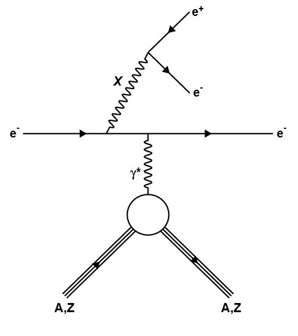
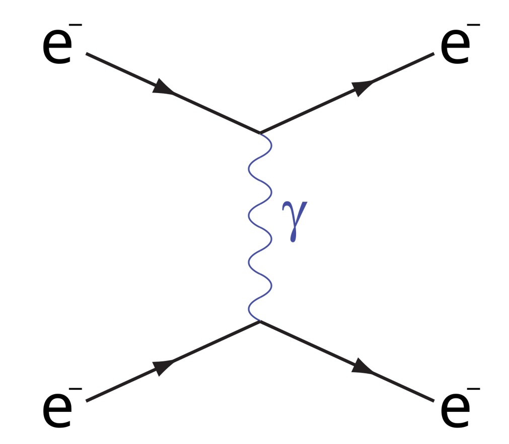

# x17_firstanalyzer
This repository takes in reconstructed experimental data from the PRad Collaboration's X17 (E12-21-003) experiment, and form ROOT files with histograms before and after each cut for intiial analysis frameworks for the following event types (the Ta is never detected and typically servers as a spectator.):

<b>
A'/Protophobic Boson-like: e−+Ta $\rightarrow$ e− + X + Ta $\rightarrow$ e− + e+ + e−+ Ta (assuming X→e^+^e^-^)
</b> 
<figure>

<figcaption>
<i>Bremsstrahlung-like X particle generation diagram.</i>
</figcaption>
</figure>
<b>
QED Meson-like: e−+Ta $\rightarrow$ e− + X + Ta $\rightarrow$ e− + &gamma; + &gamma; + Ta (assuming X→&gamma; + &gamma;)
</b> 
<b>
M&oslash;ller (for mass resolution): 𝒆−+ Ta $\rightarrow$ 𝒆−+ Ta+ + 𝒆−
</b> 
<figure>

<figcaption>
<i>M&oslash;ller process Feynman diagram.</i>
</figcaption>
</figure>

## Run Options
|Option|Input|Description|Default Value|
|:----:|:----:|:--------:|:----------:|
|-f|\<FileName>.root|Runs the base analysis on the given file that has the format described below.|<b>Optional*</b>; Either -f or -L is required. Both can be provided and the -f will be added to the list.|
|-L|\<Filelist>.txt|Runs the analysis for all files in the provided .txt file in the format described below.|<b>Optional*</b> See above.|
|-o|\<outputFileName>|output file name (no extension) that will be saved to the output directory|"default"|
|-b|\<Run Number>|Batch running where the provided run number is used to make a directory in the output directory with this run number and then make this new directory the output directory.|<b>Optional</b>;  Will find the first continuous string of numbers in the provided file name and assume it is the run number to be used in histogram titles.|

## Input File Formats
### Individual File Input
If the -f option is used then the executable expects a .root file in the format of the PRad-II/X17 reconstructed replay.
### File List [-L]
If the -L option is used then for input a .txt file is expected in the format of all lines having the entire file path including filename of each file to be included in analysis each separated by linebreaks.

## Selection Cuts
### X$\rightarrow$ e+ + e- Event Selection Cuts

|Cut Number|Cut Name|Cut Descriptions|
|----------|--------|----------------|
|0|None|No cuts applied. Only fills the position, energy v. polar angle (&theta;) reconstructed vertex Z histograms.|
|1|3 or More Clusters|Require that the event has at least 3 or more clusters.|
|2|Timing|$\Delta t < 16ns$  Require that the timing difference between the minimum and maximum cluster is less than 16ns.|
|3|Fiducial|Require that all clusters be outside of the first half of the first open layer of crystals and and inside the inner edge of the last layer of crystals.|
|4|Cluster Energy|$70 MeV < E_{cl_i} < 1800 MeV$ for $i=1,2,3$|
|5|Energy Sum|$\lvert E_{beam} - \overset{N=3}{\underset{i=1}\Sigma} E_{cl_i} \rvert < 5\cdot\sigma_{E_{total}}$; where   $\sigma_{E_{total}} = \sqrt{\overset{N=3}{\underset{i=1}\Sigma} \sigma_{cl_i}}$ and $\sigma_{cl_i} = \frac{3.3\%}{\sqrt{E_{cl_i}}}$|
|6|Coplanarity|$\lvert 180^\circ - \Delta\phi\rvert < 15^\circ$   where $\Delta\phi = \lvert \phi_{e'} - \phi_{x}\rvert$ for each candidate.|
|7|Candidate Energy|$E_{x} > 0.5 \cdot E_{beam}$   A majority of the beam energy was taken by the candidate particle.|
|8|1 GEM Match for All|Require that each particle have at least one of the GEMs.|
|9|2 GEM Match for All|Require that each particle have at least one match on each of the GEMs planes.|
|10|Vertex Z|$\lvert z_i \rvert < 2.0m$   All reconstructed vertices be within $2.0m$ of the target.|

### X$\rightarrow$ &gamma; + &gamma; Event Selection Cuts

|Cut Number|Cut Name|Cut Descriptions|
|----------|--------|----------------|
|0|None|No cuts applied. Only fills the position, energy v. polar angle (&theta;) reconstructed vertex Z histograms.|
|1|3 or More Clusters|Require that the event has at least 3 or more clusters.|
|2|Timing|$\Delta t < 16ns$  Require that the timing difference between the minimum and maximum cluster is less than 16ns.|
|3|Fiducial|Require that all clusters be outside of the first half of the first open layer of crystals and and inside the inner edge of the last layer of crystals.|
|4|Cluster Energy|$70 MeV < E_{cl_i} < 1800 MeV$ for $i=1,2,3$|
|5|Energy Sum|$\lvert E_{beam} - \overset{N=3}{\underset{i=1}\Sigma} E_{cl_i} \rvert < 5\cdot\sigma_{E_{total}}$; where   $\sigma_{E_{total}} = \sqrt{\overset{N=3}{\underset{i=1}\Sigma} \sigma_{cl_i}}$ and $\sigma_{cl_i} = \frac{3.3\%}{\sqrt{E_{cl_i}}}$|
|6|Coplanarity|$\lvert 180^\circ - \Delta\phi\rvert < 15^\circ$   where $\Delta\phi = \lvert \phi_{e'} - \phi_{x}\rvert$ for each candidate.|
|7|Candidate Energy|$E_{x} > 0.5 \cdot E_{beam}$   A majority of the beam energy was taken by the candidate particle.|
|8|No Match for Candidate|Require that neither particle in the candidate have <b>NO</b> match on any GEM.|
|9|1 GEM Match for e'|Require that the assumed e' have at least one of the GEMs.|
|10|2 GEM Match for e'|Require that the assumed e' have a match on both GEM layers.|
|11|Vertex Z|$\lvert z_{e'} \rvert < 2.0m$   Require the reconstructed vertex of the e' be within $2.0m$ of the target.|

### M&oslash;ller (e- - e-) Event Selection Cuts

|Cut Number|Cut Name|Cut Descriptions|
|----------|--------|----------------|
|0|2 Clusters Exactly|Require that the event has at exactly 2 clusters.|
|1|Timing|$\Delta t < 16ns$ Require that the timing difference between cluster less than is 16ns.|
|2|Fiducial|Require that all clusters be outside of the first half of the first open layer of crystals and and inside the inner edge of the last layer of crystals.|
|3|Coplanarity|$\lvert 180^\circ - \Delta\phi\rvert < 10^\circ$   where $\Delta\phi = \lvert \phi_{e'} - \phi_{e^-}\rvert$.|
|4|Candidate Energy|$E_{x} > 0.5 \cdot E_{beam}$   A majority of the beam energy was taken by the candidate particle.|
|5|Elasticity|$\lvert E_{cl_1} + E_{cl_2} - E_{beam} - m_{e}\rvert < 5\cdot\sigma_{E_{total}}$   Ensure that these particles add to having come from an elastic event.|
|6|1 GEM Match for All|Require that both particles have a match on at least one of the GEMs.|
|7|2 GEM Match for All|Require that both particles have at least one match on each of the GEMs planes.|
|8|Vertex Z|$\lvert z_i \rvert < 2.0m$   All reconstructed vertices be within $2.0m$ of the target.|

## Histogram Formatting
Below are tables describing the different histograms that are saved to the outputted ROOT file with the naming convention

 "h_&ltParticle (X, Xgg, M)&gt_&ltVariable to Save&gt_cut&lt#&gt" 

 
for after which cut this histogram shows the information according to the tables found in the [Selection Cuts Section](#selection-cuts). Here "X" represents the e+e- decay, "Xgg" represents the &gamma;&gamma; decay, and "M" represents the M&oslash;ller event histograms.

### X Candidate Particle Histograms:
###### (for both decay channels)
|Name|Variable|Histogram Type|Description|Also M&oslash;ller?**|
|:----:|:------:|:----------:|:---------:|:-----------------:|
|HyCal Position|HC_XY|TH2F|(X,Y) position of each cluster still with at least one X candidate elligible after the most recent cut.|✔|
|Energy v. Polar Angle (&theta;)|E_theta|TH2F|(E,&theta;) for each cluster still with at least one X candidate elligible after the most recent cut.|✔|
|$p_t$:  Transverse Momentum Sum*|Sum_pt|TH1F|Transverse Monmentum of the sum of the 3 particle's Energy-Momentum four-vectors|✔|
|$p_x$ v. $p_y$:  X and Y Momentum Sum*|Sum_pxVpy|TH1F|($p_x$, $p_y$) coordinates for the X and Y components of the 3 particle's Energy-Momentum four-vectors|✔|
|$\Delta\phi_{X-e'}$  Difference in $\phi$|diffPhi|TH1F|$\lvert\phi_X - \phi_e'\rvert$  $\phi$ difference between the candidate particle and the assumed e' in $^\circ$|✔|
|$\Delta t$ Timing|timing|TH1F|$t_{max}-t_{min}$ maximum difference in timing between clusters being considered in each combination of 3.|✔|
|$z$ vertex z of all possible|vZ_All|TH1F|$z$ vertex z of all the possible particles for each event that still has elligible candidates|✔|
|$z_{E_{min}}$ vertex z of minimum energy cluster|vZ_Min_E|TH1F|$z$ vertex z of the minimum energy cluster for each still elligible candidate|X|
|$z_{E_{med}}$ vertex z of median energy cluster|vZ_Med_E|TH1F|$z$ vertex z of the median energy cluster for each still elligible candidate|X|
|$z_{E_{max}}$ vertex z of maximum energy cluster|vZ_Max_E|TH1F|$z$ vertex z of the maximum energy cluster for each still elligible candidate|X|
|Energy Sum|sumE|TH1F|$\overset{N=3}{\underset{i=1}\Sigma} E_{cl_i}$  energy sum of each still elligible 3 cluster combinations|✔|
|Minimum Energy|minE|TH1F|$E_{cl_{min}}$  energy minimum cluster energy of each still elligible 3 cluster combinations|X|
|Median Energy|medE|TH1F|$E_{cl_{med}}$  energy median cluster energy of each still elligible 3 cluster combinations|X|
|Maximum Energy|maxE|TH1F|$E_{cl_{max}}$  energy maximum cluster energy of each still elligible 3 cluster combinations|X|

<b>\* - the momentum variables for the &gamma; &gamma; decay show the momentum sum for each still elligible candidate particle, since the momentum sums vary depending which two particles are assumed to be the photons. 

\*\* - The "Also M&oslash;ller?" column indicates histograms that are also filled for M&oslash;ller before and after each cut.
</b>